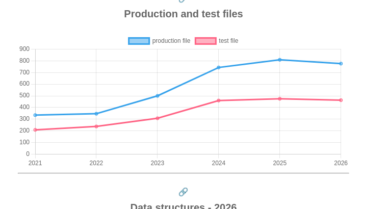

# Explorando evolução de código

Neste exercício, iremos explorar a evolução de código em sistemas reais.

Iremos utilizar a ferramenta [GitEvo](https://github.com/andrehora/gitevo).
Essa ferramenta analisa a evolução de código em repositórios Git nas linguagens Python, JavaScript, TypeScript e Java, e gera relatórios `HTML` como [este](https://andrehora.github.io/gitevo-examples/python/pandas.html).

Mais exemplos de relatórios podem ser podem ser encontrados em https://github.com/andrehora/gitevo-examples.

# Passo 1: Selecionar repositório a ser analisado

Selecione um repositório relevante na linguagem de sua preferência (Python, JavaScript, TypeScript ou Java).
Você pode encontrar projetos interessantes nos links abaixo:

- Python: https://github.com/topics/python?l=python
- JavaScript: https://github.com/topics/javascript?l=javascript
- TypeScript: https://github.com/topics/typescript?l=typescript
- Java: https://github.com/topics/java?l=java

# Passo 2: Instalar e rodar a ferramenta GitEvo

> [!NOTE]
> Antes de instalar a ferramenta, é recomendado criar e ativar um [ambiente virtual Python](https://packaging.python.org/en/latest/guides/installing-using-pip-and-virtual-environments/#create-and-use-virtual-environments).

Instale a ferramenta [GitEvo](https://github.com/andrehora/gitevo) com o comando:

```
$ pip install gitevo
```

Execute a ferramenta no repositório selecionado utilizando o comando abaixo (ajuste conforme a linguagem do repositório).
Substitua `<git_url>` pela URL do repositório que será analisado:

```shell
# Python
$ gitevo -r python <git_url>

# JavaScript
$ gitevo -r javascript <git_url>

# TypeScript
$ gitevo -r typescript <git_url>

# Java
$ gitevo -r java <git_url>
```

Por exemplo, para analisar o projeto Flask escrito em Python:

```
$ gitevo -r python https://github.com/pallets/flask
```

> [!NOTE]
> Essa etapa pode demorar alguns minutos pois o projeto será clonado e analisado localmente.

# Passo 3: Explorar o relatório de evolução de código

Após executar a ferramenta [GitEvo](https://github.com/andrehora/gitevo), é gerado um relatório `HTML` contendo diversos gráficos sobre a evolução do código.

Abra o relatório `HTML` e observe com atenção os gráficos.

# Passo 4: Explicar um gráfico de evolução de código

Selecione um dos gráficos de evolução e explique-o com suas palavras.
Por exemplo, você pode:

- Detalhar a evolução ao longo do tempo
- Detalhar se as curvas estão de acordo com boas práticas
- Explicar grandes alterações nas curvas
- Explorar a documentação do repositório em busca de explicações para grandes alterações
- etc.

Seja criativo!

# Instruções para o exercício

1. Crie um `fork` deste repositório (mais informações sobre forks [aqui](https://docs.github.com/pt/pull-requests/collaborating-with-pull-requests/working-with-forks/fork-a-repo)).
2. Adicione o relatório `HTML` no seu fork.
3. No Moodle, submeta apenas a URL do seu `fork`.

Responda às questões abaixo diretamente neste arquivo `README.md` do seu fork:

1. Repositório selecionado: [https://github.com/fastapi/fastapi](https://github.com/fastapi/fastapi)
2. Gráfico selecionado: 
3. Explicação: 

O gráfico apresenta a evolução quantitativa dos arquivos de produção (linha azul) e de teste (linha rosa) entre os anos de 2021 e 2026, revelando um ciclo de crescimento acelerado seguido por um período de estabilização e ajuste. Entre 2021 e 2022, o projeto manteve um desenvolvimento linear e estável, mas a partir de 2023, observa-se uma inclinação acentuada que atinge seu ápice em 2025. O salto significativo em 2024, onde os arquivos de produção subiram de aproximadamente 500 para cerca de 750, indica uma fase de expansão de escopo agressiva, possivelmente ligada à implementação de novas funcionalidades em APIs REST ou arquiteturas de microserviços.

Em relação às boas práticas, há uma correlação positiva saudável entre as duas curvas: sempre que a linha de produção sobe, a de testes acompanha o movimento, demonstrando que o desenvolvimento de novas funcionalidades não ignorou a validação. No entanto, nota-se que o "gap" entre as linhas aumentou com o tempo. Em 2021, a proporção era de aproximadamente 1,5 arquivos de produção para cada 1 de teste, enquanto em 2025 essa distância cresceu, sugerindo que a complexidade do código de produção evoluiu mais rápido do que a infraestrutura de testes unitários e de integração.

A leve retração observada em 2026 em ambas as métricas é um sinal positivo de maturidade do repositório. Esse movimento geralmente caracteriza um período de refatoração e limpeza, onde arquivos obsoletos, duplicados ou redundantes são removidos para melhorar a manutenibilidade do sistema. O comportamento sugere que, após o grande esforço de entrega entre 2024 e 2025, o foco atual do projeto mudou da expansão para a sustentabilidade e otimização do código existente.


